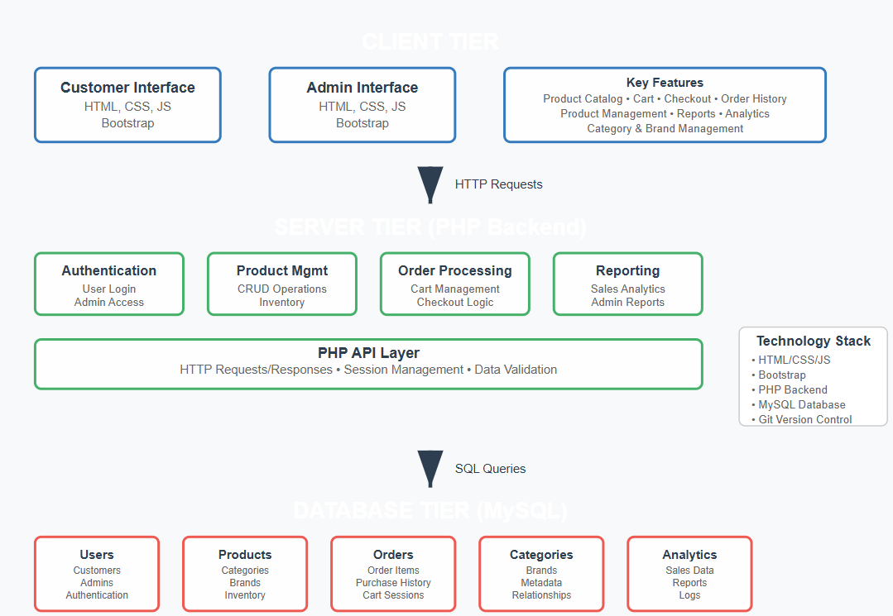

<h1>🛒 EMart – E-Commerce Application</h1>

EMart is a web-based single-vendor e-commerce platform built to provide a smooth shopping experience for customers while giving admins full control over managing products, categories, brands, and orders. (1st year Web Programming Project)

<b>🏗️ Architecture</b>

  

<h2>⚙️ Tech Stack</h2>
<ul>
  <li><b>Frontend:</b> HTML, CSS, JavaScript </li>
  <li><b>Backend:</b> PHP </li>
  <li><b>Database:</b> MySQL</li>
  <li><b>Other Tools:</b> Git, Bootstrap</li>
</ul>

<h2>🚀 Features</h2>
<ul>
  <li>User-friendly product catalog</li>
  <li>Cart and checkout functionality</li>
  <li>Order management with purchase history</li>
  <li>Admin panel for product, category, and brand management</li>
  <li>Reports and analytics for admins</li>
</ul>